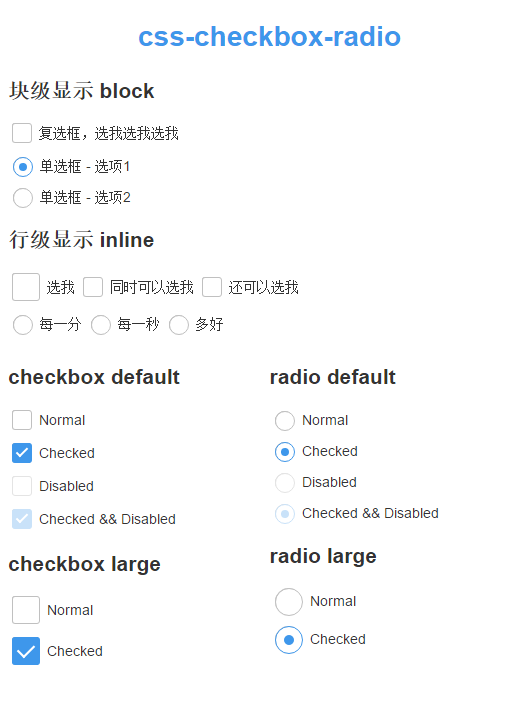

# css-checkbox-radio
Beautify Radio and Checkbox.

### Demo

[Demo](https://github.com/chutou/css-checkbox-radio)



### Install
- bower: `bower install --save css-checkbox-radio`
- npm: `npm install --save css-checkbox-radio`

### Usage

```html
<link rel="stylesheet" href="bower_components/css-checkbox-radio/dist/css-checkbox-radio.css">
```

**Checkbox**

```html
<h1>css-checkbox-radio</h1>
    <div class="col-6">
        <h2>checkbox default</h2>
        <div>
            <label class="checkbox">
                <input type="checkbox" name="layout" id="1"> Normal</label>
        </div>
        <div>
            <label class="checkbox">
                <input type="checkbox" name="layout" id="2" checked="checked"> Checked
            </label>
        </div>
        <div>
            <label class="checkbox">
                <input type="checkbox" name="layout" id="3" disabled="disabled"> Disabled
            </label>
        </div>
        <div>
            <label class="checkbox">
                <input type="checkbox" name="layout" id="4" checked disabled="disabled"> Checked && Disabled</label>
        </div>
        <h2>checkbox large</h2>
        <div>
            <label class="checkbox" for="10">
                <input class="lg" type="checkbox" name="layout" id="10"> Normal</label>
        </div>
        <div>
            <label class="checkbox" for="20">
                <input class="lg" type="checkbox" name="layout" id="20" checked="checked"> Checked</label>
        </div>
    </div>
```

**Radio**

```html
<div class="col-6">
        <h2>radio default</h2>
        <div>
            <label class="radio">
                <input type="radio" name="radio" id="11"> Normal</label>
        </div>
        <div>
            <label class="radio">
                <input type="radio" name="radio" id="22" checked> Checked</label>
        </div>
        <div>
            <label class="radio">
                <input type="radio" id="33" disabled="disabled"> Disabled</label>
        </div>
        <div>
            <label class="radio">
                <input type="radio" id="44" disabled="disabled" checked> Checked && Disabled</label>
        </div>
        <h2>radio large</h2>
        <div>
            <label class="radio" for="101">
                <input class="lg" type="radio" name="radio-large" id="101"> Normal</label>
        </div>
        <div>
            <label class="radio" for="202">
                <input class="lg" type="radio" name="radio-large" id="202" checked> Checked</label>
        </div>
    </div>
```

### Browser compatibility

- Chrome
- Firefox
- Safari
- Opera
- IE9 && IE9+


### License

  [MIT](LICENSE)
